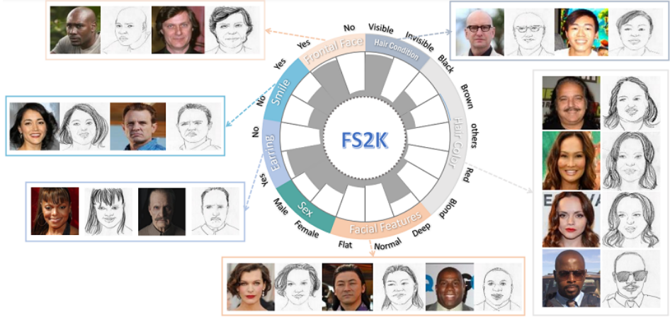

# 线稿人脸属性识别



## 数据集获取方式

https://github.com/DengPingFan/FS2K

## 文件结构
请将下载好的FS2K数据集按照下面的方式排放
```
0              
├─ FS2K                      数据集
│  ├─ photo                  真实图片
│  ├─ sketch                 线稿图片
│  ├─ README.pdf             
│  ├─ anno_test.json         测试集json
│  └─ anno_train.json        训练集json
├─ result                    输出结果
├─ FS2K.py                   数据集数据处理以及加载器
├─ config.py                 参数文件
├─ faceAttr_trainer.py       训练以及评估代码
├─ model.py                  网络结构
├─ train.py                  开启代码
└─ utils.py                  工具
```
## 快速开始

#### train

```python
python train.py
```


